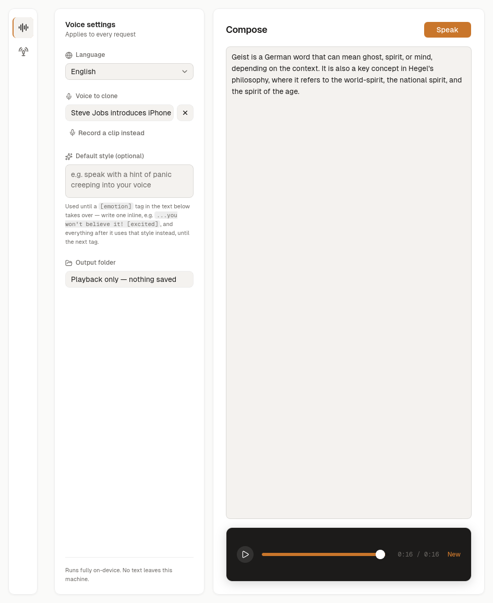

# oido-tts

A local, private text-to-speech desktop app built on Qwen3-TTS via
llama.cpp. Everything — synthesis, voice cloning, recording — runs
on-device; no text or audio ever leaves the machine.

- **Compose** — type or paste text, get speech back. Optional voice
  cloning from a reference clip, inline `[emotion]` style tags, and
  per-request language selection.
- **Podcast** — turn a `Speaker: line` script into one stitched
  multi-speaker episode, each speaker with its own voice.
- **Voice cloning** — pick a wav/mp3 reference file, or record one
  directly in the app (mic capture happens via `arecord`, not the
  browser, since WebKitGTK disables `getUserMedia` on Linux by default).
- **MCP server** — the same synthesis pipeline is also exposed as an MCP
  server (`cmd/oido-tts-mcp`) so any MCP client (Claude Desktop, Claude
  Code, etc.) can call it as a tool. See [MCP server](#mcp-server) below.

Built with [Wails 3](https://v3.wails.io/) (Go backend, React/TypeScript
frontend, Tailwind v4, shadcn/ui).



Sample output (default voice, no cloning): [docs/media/sample.wav](docs/media/sample.wav)

## How it works

Text is chunked into pieces sized for what Qwen3-TTS was tuned for (see
`internal/tts.ChunkText`), synthesized one chunk at a time through
`llama-tts` (concurrent calls would each load the full model into memory
independently — sequential keeps memory to one model's worth regardless of
input length), then concatenated into a single wav. Repeat calls with
identical inputs are served from an on-disk cache (`internal/tts/cache.go`)
instead of re-running the subprocess.

## Requirements

- **Go** 1.25+
- **Node.js** (npm, or set `PACKAGE_MANAGER=bun|pnpm|yarn`)
- **[Wails 3 CLI](https://v3.wails.io/)** (`wails3`) for the desktop build
- **[Task](https://taskfile.dev/)** (`task`) to run the Taskfile targets
- **A `llama-tts` build with `--tts-instruct` support.** Upstream
  llama.cpp doesn't have this flag; the vendored binary carries a local
  patch (see `internal/tts/engine.go`'s package doc and
  `build/Taskfile.yml`'s `vendor:llama-tts`). Without the patch, the
  `Instruct`/style-tag feature errors against a stock build — everything
  else works fine.
- **A Qwen3-TTS GGUF model** — the backbone model plus its `mmproj-*`
  companion file (e.g. from
  [ggml-org/Qwen3-TTS-12Hz-1.7B-Base-GGUF](https://huggingface.co/ggml-org/Qwen3-TTS-12Hz-1.7B-Base-GGUF)).

## Setup

1. Build (or obtain) `llama-tts` with `--tts-instruct` support, and
   download a Qwen3-TTS GGUF model + its mmproj file.

2. Point the app at them. Either export env vars, or put them in
   `.env.local` (picked up by the Taskfile, and by `internal/synth` at
   runtime):

   ```sh
   export LLAMA_TTS_BIN=/path/to/llama.cpp/build/bin/llama-tts
   export TTS_MODEL_PATH=/path/to/Qwen3-TTS-12Hz-1.7B-Base-Q4_K_M.gguf
   export TTS_MMPROJ_PATH=/path/to/mmproj-Qwen3-TTS-12Hz-1.7B-Base-Q8_0.gguf
   ```

   No env vars set? The desktop app still launches — its sidebar lets you
   pick the binary/model paths from the UI (`App.Configure`), which is
   what `LLAMA_TTS_BIN`/`TTS_MODEL_PATH`/`TTS_MMPROJ_PATH` override for a
   packaged build with `resources/` bundled alongside the executable (see
   `internal/synth.ResolveEnginePaths`).

3. Install frontend dependencies and run in dev mode:

   ```sh
   task dev
   ```

   This starts the app with hot-reload for both frontend and backend
   changes.

## Building

```sh
task build            # desktop app for the host OS
task build GOOS=darwin  # or windows / linux — cross-compile target
task package           # packaged installer/bundle for the host OS
task build:mcp          # the MCP server binary, at bin/oido-tts-mcp
task build:server       # headless HTTP server build (no native GUI deps)
task build:docker       # Docker image running the server build
```

`build` and `package` first run `vendor:llama-tts` and `vendor:models`,
which copy the configured `llama-tts` binary (plus its runtime `.so`
deps) and the two GGUF files into `resources/`, so the packaged app is
self-contained and needs no env vars on the target machine.

Run `task --list` for the full set of tasks (per-platform packaging,
code signing, Docker, Android/iOS scaffolding).

## Testing

```sh
go test ./... -race
```

Frontend type-checking:

```sh
cd frontend && npx tsc --noEmit
```

## Project structure

```
appservice.go            Wails-bound App service: Synthesize, BuildPodcast,
                          file/folder pickers, recording controls
main.go                  Wails app entry point (window, assets, services)
cmd/oido-tts-mcp/         MCP server entry point (stdio transport)
internal/synth/           Engine resolution + sequential job-running logic,
                          shared by the desktop app and the MCP server
internal/tts/              llama-tts subprocess wrapper, text chunking,
                          script parsing, disk cache
internal/wav/               wav read/write/concat/trim/normalize
internal/recorder/          Mic capture via arecord (voice-clone references)
frontend/src/                React UI: Compose view, Podcast view,
                          shadcn/ui components
build/                    Wails packaging config (per-platform Taskfiles,
                          icons, installers, Docker)
```

## MCP server

`cmd/oido-tts-mcp` runs the same synthesis pipeline as the desktop app
over the [Model Context Protocol](https://modelcontextprotocol.io)
(stdio transport), so any MCP client can call it directly — no UI
involved. It exposes two tools:

- **`synthesize_speech`** — `text` (required), plus optional `lang`,
  `speaker_file` (local path to a wav/mp3 voice-clone reference),
  `instruct` (style/emotion), and `output_dir`. Returns the path to the
  generated wav.
- **`build_podcast`** — `script` (required, `"Speaker: line"` per
  paragraph), plus optional `voices` (speaker name → reference clip
  path), `lang`, and `output_dir`. Returns the path to the stitched
  episode wav.

Both tools write the wav to disk and return its path (a stdio tool call
has no playback surface, so — unlike the desktop app's in-memory preview —
nothing is deleted after the call).

Build it and point an MCP client at the binary:

```sh
task build:mcp
```

```json
{
  "mcpServers": {
    "oido-tts": {
      "command": "/absolute/path/to/oido-tts-v3/bin/oido-tts-mcp",
      "env": {
        "TTS_MODEL_PATH": "/path/to/Qwen3-TTS-12Hz-1.7B-Base-Q4_K_M.gguf",
        "TTS_MMPROJ_PATH": "/path/to/mmproj-Qwen3-TTS-12Hz-1.7B-Base-Q8_0.gguf",
        "LLAMA_TTS_BIN": "/path/to/llama-tts"
      }
    }
  }
}
```

The server fails fast with a clear error on startup if no model can be
resolved (bundled `resources/models/*.gguf` or the env vars above), and
each tool call returns a well-formed tool error (`isError: true`) rather
than crashing the session — invalid input, unresolvable schema, or a
failed synthesis all come back as a normal, inspectable result.
